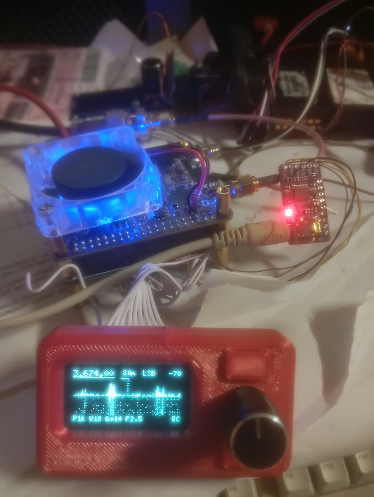

# Radioberry_Pico2

**Receptor SDR HF standalone: Radioberry v2 + RP2350, fără Linux, fără PC.**



*Radioberry v2 (cu ventilator) pe RP2350-PiZero, PCM5102A în dreapta, panoul cu OLED și encoder în
carcasă printată 3D — recepție LSB pe 3,674 MHz.*

Radioberry_Pico2 este un receptor HF experimental construit în jurul plăcii **Radioberry v2 (CL025)**
înfipte direct într-un **Waveshare RP2350-PiZero**.

FPGA-ul Radioberry face partea grea (AD9866, NCO, decimare) și livrează IQ la 48 kHz. RP2350 citește
IQ-ul prin PIO + DMA, face toată demodularea și DSP-ul audio, desenează spectrul și waterfall-ul pe un
OLED și scoate sunetul pe căști.

În funcționare normală nu are nevoie de Raspberry Pi, PC sau sistem de operare: alimentezi, pui
antena și căștile și merge ca receptor de sine stătător. Legat la PC pe USB, apare în plus ca
**placă de sunet (microfon USB)** + **port CAT Kenwood TS-2000**, deci merge direct cu WSJT-X, fldigi,
HDSDR.

**Stare (5 oct 2026): recepția funcționează**, testată pe aer — AM pe 31/41 m, SSB pe 40 m, FT8
decodat în WSJT-X pe 60 m și 40 m prin microfonul USB al plăcii. Emisia (TX) nu e implementată încă.

---

## MULȚUMIRI

**Johan — PA3GSB**, autorul Radioberry: gateware-ul FPGA și driverul host pe care se bazează
legătura RP2350 ↔ Radioberry.

**WP3DN — [RagchewBerry](https://github.com/wp3dn/RagchewBerry)**: a demonstrat primul arhitectura
Radioberry + RP2350 standalone; de la 3 oct 2026 firmware-ul de aici folosește gateware-ul lui
**PIO 75.2** (citire IQ pe 4 linii cu PIO).

Alte proiecte folosite: Hermes-Lite 2 (gateware 73.x), arduino-pico (Earle Philhower),
Adafruit TinyUSB, U8g2. Toate rămân ale autorilor lor, sub licențele lor.

---

## FUNCȚII

**Recepție**
- 10 kHz – 30 MHz, IQ 48 kHz de la FPGA, DSP la 12 kHz pe RP2350
- Moduri: **USB, LSB, CW, AM, FM** (bandă îngustă), **SAM** (AM sincron cu PLL pe purtătoare)
- Filtre selectabile pe mod:

  | Mod | Lățimi |
  |---|---|
  | USB / LSB | 1,8 · 2,0 · 2,5 · 2,7 kHz |
  | CW | 250 · 500 · 1000 Hz (ton 700 Hz) |
  | AM / SAM | 6 · 8 kHz |
  | FM | 8 · 11 kHz |

- AGC
- Câștig RF reglabil, -12 … +48 dB
- **Squelch** relativ la zgomot, +1 … +40 dB (zgomotul se estimează singur)
- **Reducere de zgomot** NR 1 / 2 / 3 (+9 … +14,5 dB SNR, simulat)
- **Calibrare de frecvență** în ppb, automat din SAM pe o stație AM sau manual (salvată)
- Pas de acord 10 Hz / 100 Hz / 1 kHz / 10 kHz / 100 kHz
- Baleiaj de bandă (comandă USB)

**Benzi cu memorie** (frecvență + mod reținute pe fiecare):
160, 80, 60, 49 (AM), 40, 41 (AM), 31 (AM), 30, 20, 17, 15, 12, CB (FM), 10 m

**Afișaj** (OLED 128×64)
- Frecvență, bandă, mod, S-metru
- Spectru ±24 kHz + waterfall
- Bara de jos: pas, volum, câștig, filtru; indicatori Q (squelch), N (NR), RC (butoane)

**Placa de sunet**
- **Căști:** DAC I2S **PCM5102A**, 48 kHz, volum 0–100
- **USB:** microfon **„Radioberry RX audio”**, 48 kHz mono, audio demodulat la nivel fix
  (independent de volumul căștilor și de squelch) → WSJT-X, fldigi, înregistrare

**USB către PC** (un singur cablu)
- Port serial: comenzi text + **CAT Kenwood TS-2000** (frecvență, mod, S-metru)
- Microfon USB (vezi mai sus)
- **IQ brut 24 bit** → fișier WAV pentru HDSDR / SDR# / SDR++

**Altele**
- Setările (frecvență, mod, filtre, volum, benzi, calibrare) se salvează singure în flash
- Gateware-ul FPGA e inclus în firmware și se încarcă la pornire

---

## HARDWARE

| Bloc | Piesă |
|---|---|
| Procesor | Waveshare **RP2350-PiZero** (RP2350B, 2× Cortex-M33 @150 MHz, 16 MB flash) |
| Radio | **Radioberry v2, Cyclone 10 LP 10CL025** + AD9866 (doar CL025 testat) |
| Audio | modul **PCM5102A** (I2S) + căști |
| Afișaj | OLED 1,3" 128×64, I2C |
| Comenzi | encoder rotativ cu buton + butoanele MOD și BANDA |
| Alimentare | 5 V / 2 A extern |

Radioberry se înfige direct în header-ul de 40 de pini al PiZero; restul se leagă cu fire.

Numerele GP de mai jos sunt GPIO-uri RP2350 — pe PiZero **nu** coincid mereu cu numerotarea BCM.

---

## PINI

### Ce legi tu

| Pin header | GP | Funcție | Se leagă la |
|---|---|---|---|
| 1 | — | 3V3 | PCM5102A VIN, OLED VCC |
| 3 | GP2 | I2C SDA | OLED SDA |
| 5 | GP3 | I2C SCL | OLED SCL |
| 7 | GP14 | I2S DATA | PCM5102A DIN |
| 8 | GP4 | I2S BCK | PCM5102A BCK |
| 10 | GP5 | I2S LRCK | PCM5102A LCK |
| 18 | GP24 | rețeaua de butoane (RC) | encoder SW, MOD, BANDA — vezi mai jos |
| 27 | GP0 | encoder A | encoder CLK |
| 28 | GP1 | encoder B | encoder DT |
| GND | — | masă | PCM5102A, OLED, encoder, butoane |

**PCM5102A:** SCK → GND, XSMT → 3V3, FLT / DEMP / FMT → GND.
**Encoder:** comunul la GND; pinul „+” al modulului **nelegat** (pull-up-urile lui încurcă butoanele).

### Folosiți de Radioberry (nu legi nimic)

| Semnal | GP |
|---|---|
| Date RX D0–D3 (PIO) | GP18, GP19, GP20, GP21 |
| Ceas RX | GP6 |
| SPI SCLK / MOSI / MISO / CE0 / CE1 | GP10 / GP11 / GP12 / GP8 / GP7 |
| RDY | GP25 |
| FPGA nCONFIG / CONF_DONE / nSTATUS | GP27 / GP22 / GP26 |
| FPGA DCLK / DATA0 (doar la pornire) | GP24 / GP13 |
| TX_DATA / TX_RDY (rezervate) | GP15 / GP9 |
| ieșire FPGA — **NU LEGA** | GP17 (pin 11) |

### Butoanele — toate pe un singur pin

Header-ul nu are pin analogic liber, așa că butoanele se recunosc după timpul de descărcare al unui
condensator prin rezistența fiecăruia:

```
 pin 18 (GP24) ──[ 470 Ω ]──┬──────────┬──────────┬──────────┐
                            │          │          │          │
                       tantal 1 µF  encoder SW    MOD       BANDA
                       (+ spre nod)    │          │          │
                            │          │       [1 kΩ]    [2,2 kΩ]
 GND ───────────────────────┴──────────┴──────────┴──────────┘
```

Rezistorul de 470 Ω e obligatoriu (izolează condensatorul de DCLK cât se încarcă FPGA-ul).
Nu ține niciun buton apăsat la pornire.

---

## COMENZI DE PE PANOU

| Comandă | Acțiune |
|---|---|
| Encoder rotit | acord frecvență / schimbă parametrul selectat |
| Encoder apăsat | parametrul următor din meniu |
| Encoder apăsat lung | înapoi la frecvență |
| MOD | USB → LSB → CW → AM → FM → SAM |
| BANDA scurt | banda următoare |
| BANDA lung | banda anterioară |

**Meniul encoderului:** FRECV → PAS → MOD → FILTRU → BANDA → VOL → GAIN → SQL → NR → CAL

---

## USB — PLACA DE SUNET ȘI CAT

Placa apare în Windows ca **port COM** + **„Microphone (Radioberry RX audio)”**.

**WSJT-X / fldigi:** Rig **Kenwood TS-2000**, portul plăcii, 115200 8N1, Handshake None,
**DTR High**, PTT VOX/None, Mode USB; Audio Input = *Microphone (Radioberry RX audio)*;
pe placă filtru 2,7 kHz.

**IQ brut:** `python tools/iq_record.py -t 60 -o iq_rec` → WAV pentru HDSDR / SDR# / SDR++.

**Comenzi text** (115200):

| Comandă | Efect |
|---|---|
| `s` | stare |
| `f<Hz>` | frecvență |
| `m<0-5>` | mod (0 USB, 1 LSB, 2 CW, 3 AM, 4 FM, 5 SAM) |
| `v<0-100>` | volum |
| `g<-12..48>` | câștig RF |
| `w<Hz>` | lățime filtru |
| `l<dB>` | squelch peste zgomot (1–40, `l0` oprit) |
| `n<0-3>` | reducere de zgomot |
| `c` / `c<ppb>` | calibrare automată (în SAM) / manuală |
| `z<start,stop,pas kHz>` | baleiaj |
| `q1` / `q0` | flux IQ pornit / oprit |
| `k` / `kd` | stare / diagnostic butoane |

---

## COMPILARE ȘI SCRIERE PE PLACĂ

**Cu fișier UF2 gata făcut:** descarcă `.uf2` din
[**Releases**](https://github.com/radioman30/Radioberry_Pico2/releases) (include gateware-ul FPGA),
ține **BOOT** apăsat, conectează USB, copiază `.uf2` pe discul **RP2350** care apare. Placa repornește singură.

**Din sursă:**
1. **Gateware** (binar terț, nu e în repo): `radioberry.rbf` PIO 75.2 din
   [RagchewBerry](https://github.com/wp3dn/RagchewBerry) (`components/gateware/bitstreams/CL025/`),
   copiat ca `gateware/ragchewberry_pio_CL025.rbf`, apoi
   `python tools/make_gateware_header.py gateware/ragchewberry_pio_CL025.rbf rx_audio "<origine>"`
2. **Toolchain:** arduino-pico (core `rp2040:rp2040` 5.x), placa `waveshare_rp2350_pizero`,
   biblioteca U8g2, stiva USB Adafruit TinyUSB
3. **Compilare + flash:** `powershell -File tools\build_rx_audio.ps1 -Flash`

---

## ÎN LUCRU

- **WM8960 Audio HAT** în locul PCM5102A — căști + microfon pentru emisie
- **TX** (SSB / CW / AM / FM), primul test pe sarcină artificială 50 Ω
- Butoane FILTRU și PAS pe aceeași rețea RC (pregătite în firmware)

---

## DOCUMENTAȚIE

| Fișier | Conținut |
|---|---|
| [`PINI_SI_FIRMWARE.md`](PINI_SI_FIRMWARE.md) | pini complet, istoricul modificărilor, probleme cunoscute, calibrare |
| [`WIRING.md`](WIRING.md) | cablaj detaliat și capcane |
| [`PROTOCOL.md`](PROTOCOL.md) | protocolul RP2350 ↔ FPGA (SPI de control, IQ pe PIO), gateware 73.3 și 75.2 |
| [`docs/JURNAL_PROIECTARE.md`](docs/JURNAL_PROIECTARE.md) | planul inițial, decizii, riscuri (istoric) |

---

## Licență

Codul și documentația: **MIT** — vezi [`LICENSE`](LICENSE).
Gateware-ul FPGA (`radioberry.rbf`) nu face parte din repo și are licența proiectelor de origine
(Radioberry / PA3GSB, Hermes-Lite 2, RagchewBerry); se descarcă separat.
